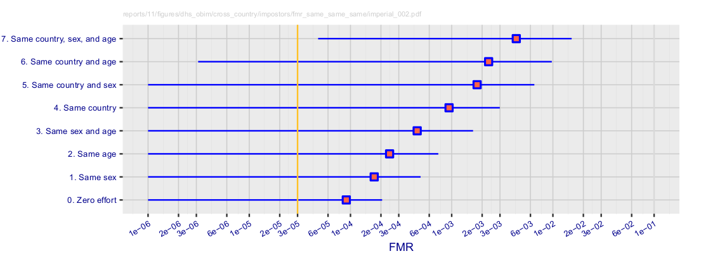
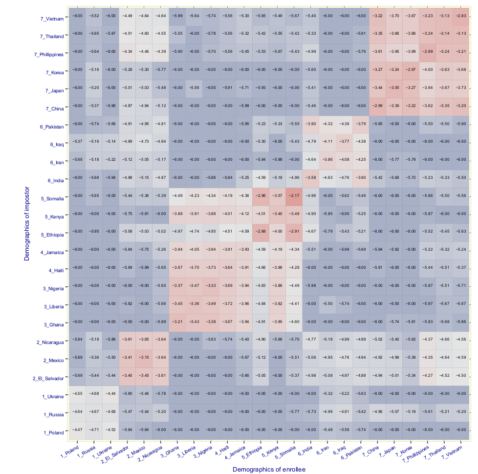
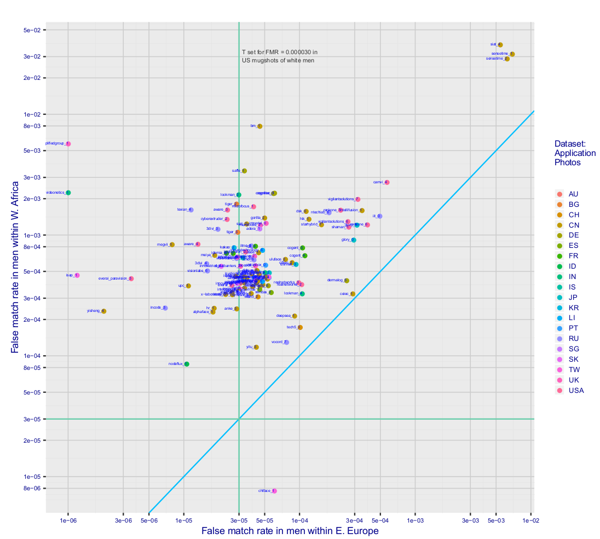
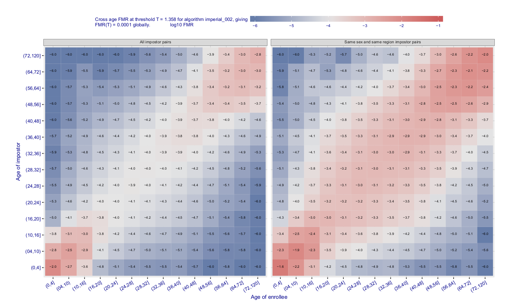
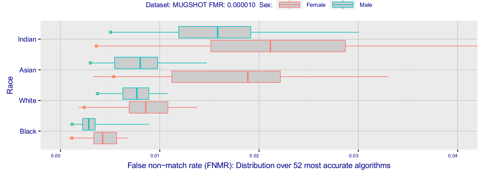

# Face Recognition Vendor Test - Part 3: Demographic effects

This is a summary of the most important parts from the FRVT 2019 [Part 3](https://nvlpubs.nist.gov/nistpubs/ir/2019/NIST.IR.8280.pdf), where demographics was addressed.
This should be "digested" with the NIST report on the side, since the report is cited all the time.

## About the dataset

The NIST report quantified the accuracy of face recognition for the following demographic groups: **gender, age, ethnicity/country of birth** (here they assumed that country of birth is a good proxy for ethnicity).
The tests were carried out with systems from 106 vendors/universities (p. 25) and with four large datasets of photographs collection in the U.S governamental applications that are currently in operation and they are the following:  

 - **Domestic mugshots** collected in the United States.
 - **Application photographs** from a global population of applicants for immigration benefits.
 - **Visa photographs** submitted in support of visa applicants.
 - **Border crossing photographs** of travelers entering the United States.

The first 3 datasets have good compliance with image capture standards (ICAO).
The last one, does not have since images were captured in during the border crossing procedure.
Together this dataset contains:

  - 8.49M subjects
  - People from 24 countries (7 distinct regions)
  - Age from 6 distinct cohorts
  - 18.27M comparisons 

## Verification findings

The set of analysis for face verification (from p. 28) are split in to 2 parts.
The first one focus on **Impostors (False Positives evaluation - p.28)** and the second one focus on **Genuines (False negatives evaluation - p. 53)**.

### False positives evaluation.

False positives (or false alarms) occurs when samples from two individuals, when compared, present a score higher than a decision threshold `T` (such threshold is a fixed value for most biometric systems).
The risk of a false alarm in a biometric system depends of the application, of course, but it is pretty obvious (i'll not discuss this here and just go direct to the point).
In the topics below it is summarized the findings about the impact of different demographics in the impostors score distribution.

#### False match rates under demographic pairing.

**Experiment**: In p. 30 it's described (for all systems) the impact (in terms of `FMR(T)`) of matching pairs of impostors based on specific cohorts.
For this, **they pick `T` that corresponds to FMR at 0.00003** from a random impostor score distribution (not looking to any covariate).
Then, several experiments were carried out by changing how imposters are grouped; as it can be observed in the figure below and in Figute 4 of the report (p .33).
  

**Finding 1**: FMR increases once the pairs of impostors are from the same cohort.
For a group of impostors from random cohorts, FMR is lower.
Once the impostors are matched according to different cohorts (same age, gender and ethnicity groups) FMR increases.

#### False match rates within and across countries

**Experiment**: 442.019 high quality images from 24 countries were compared with 441.517 images of different individuals from the same countries and `FMR(T)` was measured.
This analysis also was carried by **gender** focusing only in the target **age (35-50]**  (they call this age zone as "real world impostors").
The threshold `T` was set in another dataset (law enforcement mugshots) containing 93.070.400 imposters (I'm assuming mostly americans) and it corresponds to FMR at 0.00003 in this distribution.
The figure below (p. 35) shows the `FMR(T)` hit map (in `log10` with the lower bound clip in -6) containing all the country combinations.
This analysis was carried out with the system imperial\_002 (more systems in the Annex 7).
**IMPORTANT** All the trends observed here, was observed for other systems too.

**Finding 2**: Reinforcing finding 1, mixing the comparisons from different cohorts leads to lower FMR (obviously).

**Finding 3**: Nominal FMR observed in Eastern Europe population.

**Finding 4**: Higher FMR observed in East/West African countries, East Asia and Caribean countries (including Mexico). For some subpopulations, this values are two orders of magnitude higher than the nominal FMR. For some cases the level of security of this FMR corresponds to a PIN password with 2 digits only.

**Finding 5**: More accurate systems present biases, but more attenuated (look Figure 7 p.37).

**Finding 6**: Systems are less accurate with female cohort (look Figure 6 p. 36).

The reason for those shifts are unknown and "no attempts to explain these effects" were provided (p. 40).

Another view of those findings can be seem in the figure below (Figures 8, 9, 10 and 11 from p. 42).
In these figures all the 126 systems were put into perspective with two sub-populations (East Europe vs West Africa and East Europe vs East Asia).
It's possible to observe that the majority of the systems works in the nominal FMR zone for **East European male cohort** and way above the nominal FMR for **females, West african and East Asia** cohorts (please look at Figures 9, 10 and 11 p.40).

#### Dependence of the threshold `T` in FMR using impostors from USA

**Experiment**: The goal was to observe the impact, in different ethnicities and gender, of a threshold `T` computed at FMR 0.00001 using an impostor set of 3.000.000 mugshots from white males.
The figure below (Figure 12 p.46) and also Figure 13 p.48 shows the different FMR with such `T` from two different systems (imperial\_002 and yitu_003).
Again, same trends can be observed for the rest of the evaluated systems.

** Finding 7**: As expected, it was observed high FMR for the female cohorts (no matter the ethnicity) compared with males (`T` was defined with white males only).

** Finding 8**: Highest FMR with American Indians.

**Personal observation:** I don't know the purpose of this test.
It makes sense to calibrate `T` according with the cohort.
Maybe they want to be able to calibrate scores with the subpopulation that they have most samples.

#### The impact of age

**Experiment:** Using high quality application portraits it was compared 442.019 images from 24 countries with 441.517 images of different individuals within and across the following age groups: (00 − 20], (20 − 35], (35 − 50], (50 − 65], and (65 − 99].
The threshold `T` was computed over a set of 93.070.400 imposter comparisons made using a different set of images, namely the mugshots (Annex 1).
The threshold is the smallest value that for which the FMR is less than or equal to 0.00003.
The figure below (Figure 15 p.50) shows the FMR for imperial\_002 for different age sub populations with all impostor pairs and with impostor pairs matching the same gender and same region of birth.

**Finding 9:** Highest error rates when imposters match the two age extremes (the youngest and the eldest).

**Finding 10:** Corroborating with other findings, once other imposter covariates are matched, such as gender and region of birth, FMR drastically increases.

### False negatives evaluation.

False negatives (false rejection or false match) occur when samples from the same individual, when compared, present a score **lower** than a decision threshold `T` (such threshold is a fixed value for most biometric systems).
The risk of false negatives in a biometric system depends of the application, of course, but it is pretty obvious (i'll not discuss this here and just go direct to the point).
In the topics below it is summarized the findings about the impact of different demographics in the **genuine** score distribution.

#### Mugshot-Mugshot tests 

**Experiment:** In this experiment (p.53) it was analysed the demographic effects of genuine score distributions in groups defined by gender and four different ethnicity labels extracted in a mugshot database from "people from United States" (see p.53 and Annex 1).
`FNMR(T)` is reported from the **top 52 best** performing system, where the **threshold `T` was taken from the threshold that corresponds to FMR at 0.00001 over an imposters distribution from the same dataset mixing all sorts of covariates**.
The figure below (Figure 17 p.54) shows `FNMR(T)` box plots for each cohort.

**Finding 11:** "FNMR is absolutely low" (p.54). FNMR varies from ~0.5% to ~2.2% among all cohorts. NIST considers this a low value (FMR is at 0.01%). **Is it?**.

**Finding 12:** FNMR from African and African americans are the lowest ones **AND** way higher for Indians and Asians (more spread too).

**Finding 13:** **WOMEN give higher FNMR**. This is a trend observed in all conducted experiments no matter the metric.

#### Image quality of the probes vs different social covariates

**Experiment:** In this experiment (p.53) it's evaluated the impact of the quality of the probes vs different covariates in terms of `FNMR(T)`.
To address that, high quality images from passport applications (see annex 2) were used to create biometric references were compared with the corresponding pairs of images from boarding crossing frames (see Annex 4; **BY LOOKING AT THE ANNEX, THEY USE THE MEDS DATASET THAT WE HAVE HERE AT IDIAP**).
There's no information on how many identities were tested.
I have the impression that the experiments from chapter 4 and 5 were written by different people.
The quality of chapter 4 is way superior than chapter 5.
The figure below shows the `FNMR(T)` (p.55) using the best 52 face recognition systems where gender and ethnicities vary.
Furthermore, two age cohorts are defined (>=45 and <45).
`T` was defined with FMR at 0.00001 using an imposter score distribution containing all the covariates.

**Finding 14**: With very little exceptions, AGAIN, FNMR for women are higher than for man under the ethnicity.

**Finding 15**: Overall, FNMR varies at lot. In this experiment (p.55) it varies from 0.1% to 10%. 
Looking at annex 14 i could see systems providing errors **above 80% under the same constraints** (see annex 14 p.48).

**Finding 16**: Higher FNMR in subjects from African and Caribean countries.

