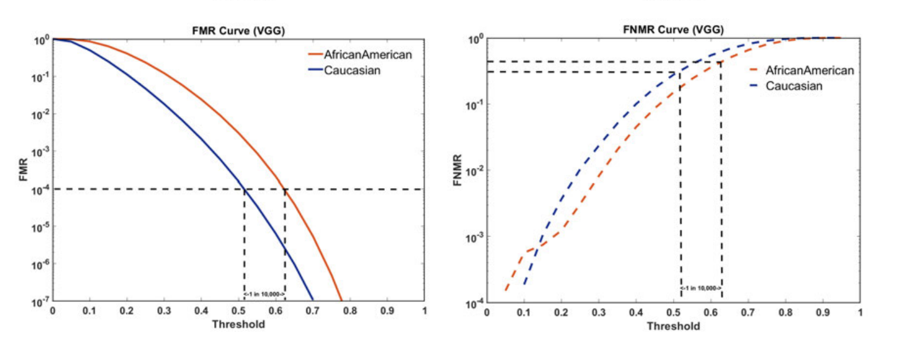
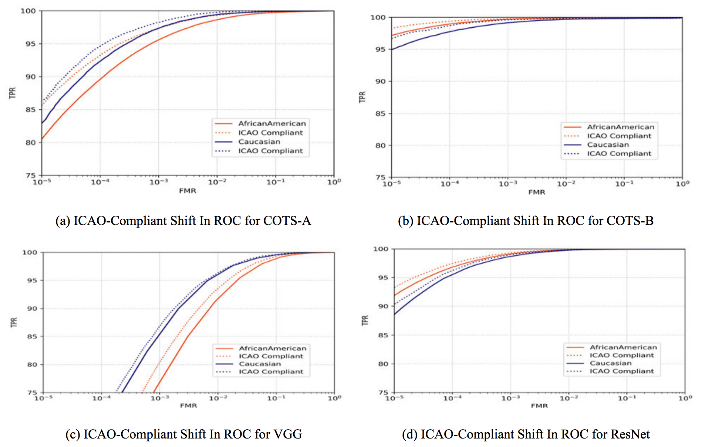

# Characterizing the Variability in Face Recognition Accuracy Relative to Race

## In a nutshell

In this paper the authors described basically the impact of two ethnicity cohorts (African Americans and Caucasians) in two COTS system and two public CNNs (VGG and Resnet) .
They basically demonstrated, using the MORPH dataset, that ROC curves and score distributions are statistically different among the two analysed cohorts.
They also reported different ICAO scores for the two different ethnicity groups.
It's a pity that only ethnicity was explored.
Morph dataset provides more information that this (for instance, age, ).

## More details

I have only three details to present.

The first one is that beinond ROC curves (which is not idea for this problem, since ROC curves operates in different thresholds for different cohorts), the authors used a threshold plot to compare cohorts so they use the same threshold (look image below).

The second point, that is an interesting aspect to analyse is how statistically different genuine/impostors score distributions are statistically different.
This could give us a grasp on how to normalize those.

The third point is with respect to image quality.
In one of the experiments it was used an ICAO software to assess the image quality of the samples of this dataset.
It was found that only 48% of images containing African American people are ICAO compliant against 57% of the of the Caucasians.

With these numbers, the authors created a subdataset containing only ICAO complient images and it's possible to observe in the image below that the already observed biases can be observed with highquality images.
However, only ROC curves are compared.
They should have done the same plot as the one befor in this page.

## Findings

**Finding 1**. Morph dataset can be used

**Finding 2**. Nice experiments comparing the statistics between score distribution plots

**Finding 2**. It seems that image quality doesn't suppress biases. Biases can be observed even with high quality ICAO images