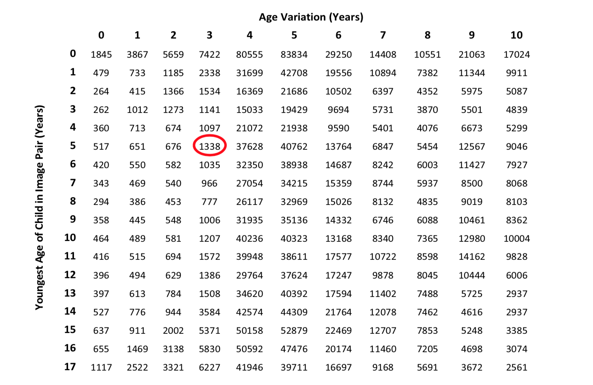
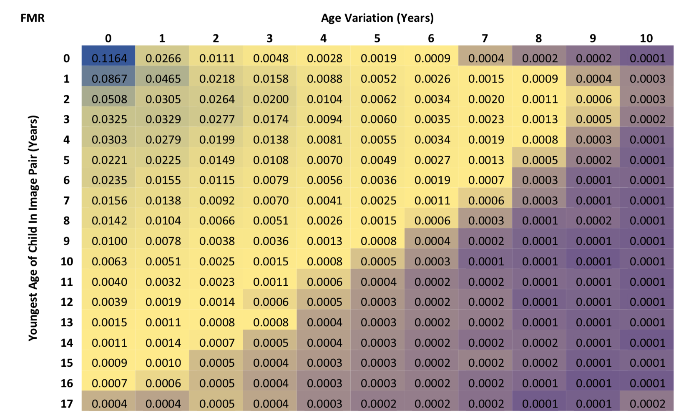
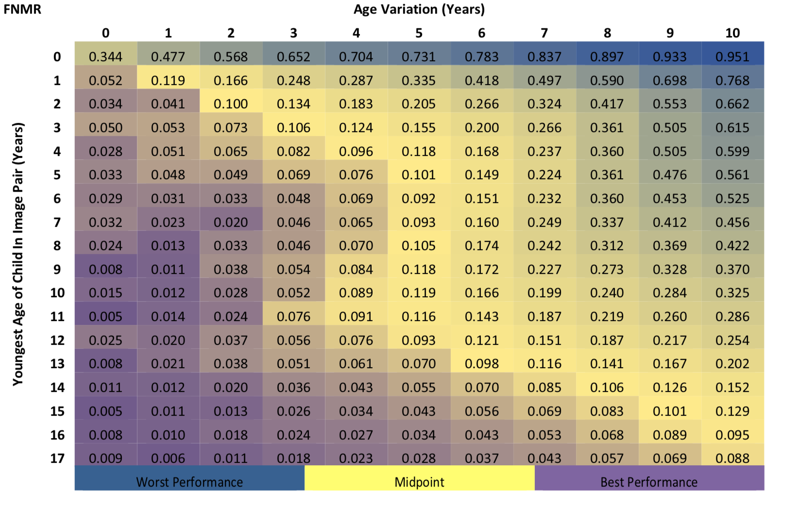

# The Impact of Age and Threshold Variation on Facial Recognition Algorithm Performance using Images of Children

## In a nutshell

In this paper the authors described basically the impact of age using one COTS system offered by NEC.
The major finding is a study carried out in a massive dataset (PRIVATE) of mugshots (~4.6M images from the australian population).
They demonstrated in that FMR and FNMR are high once age is very low (0-4 years old) and once the difference in age between the comparison pairs is very large (>3 years).

Findings are similar than the ones from NIST report, but the experiments in this paper are more granular.
Unfortunatelly, NEC didn't provide a face verification system, so we can't cross-correlate this paper with that [report](../FRVT_demographic.md).

## More details

The target population analysed was people from [0-17] years old with age variation from pairs of images varying from [0-10] years.
Follow in the image below a map of the dataset.

Two major experiments were carried out.
In the **first one**, a fixed FMR threshold was picked at 0.001 from a target population of impostors from adults (> 17 years old) and FNMR and FMR were put input perspective.

The FMR plot below shows that the COTS system starts to consistently operate under the operation point from the age of 10.

FNMR is the most dramatic one.
As can be seen in the image FNMR starts to operate under 1% of error, from image pairs >= 15 years old, with 1-year max of time span.

It was argued that an adaptative threshold (carefully tuned by age) would improve this figure of merit, but as can be seen below, improvements are very mild. 

## Findings

**Finding 1**. Nice dataset they gathered

**Finding 2**. Some observations from NIST report about age, althought this dataset is nmore granullar.