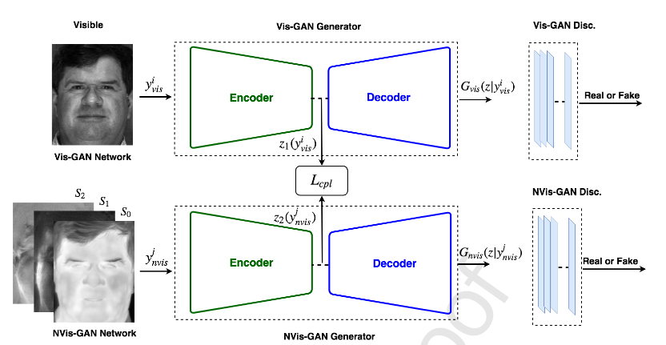

# Coupled Generative Adversarial Network for Heterogeneous Face Recognition

This paper proposes a pair of encoder/decoder mechanism in order to do the match between face images from different image modalities.
I will use the image from Figure 3 (below) to explain their strategy.

In the image, the first encoder/decoder (called Vis-GAN) is responsible to build reconstructions with of VIS (Visual light images) images.
The second encoder/decoder (called NVis GAN) is responsible to generated VIS images from a **non** VIS inputs.
The bottlenecks of both networks are coupled by the [contrastive loss](http://yann.lecun.com/exdb/publis/pdf/chopra-05.pdf), which the intention to preserve identity information.
At test time only the NVis GAN is used, where a VIS images is synthesized from a NVis image.
Future comparisons are carried our with regular face recognition systems.

## Key points
  
 - Tests with NIR-VIS datasets and Thermal to VIS datasets
 - Training an encoder/decoder is complex, training two at the same time seems a hassle
 - In this strategy **it is necessary to have the pairs of the same identity sensed in different image modalities**
 - No source code available

## Points of confusion

The authors say that the two subnetworks are GANs.
However, no noise images are used at training time.
It seems that the task of the discriminator is somewhat easy.
Maybe I'm wrong.
