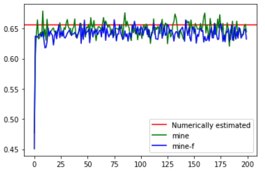

[](https://colab.research.google.com/github/tiagofrepereira2012/paper_notes/blob/master/notes/ml/MINE/MINE.ipynb)

# MINE - Mutual Information Neura Estimation - TF 2

Tensorflow 2 implementation of MINE - Mutual Information Neural Estimation (https://arxiv.org/pdf/1801.04062.pdf)


## How to use?


```python
from mine import MineModel
model = MineModel()
model.compile(optimizer="adam")
model.fit(x=[X, Z])
```


