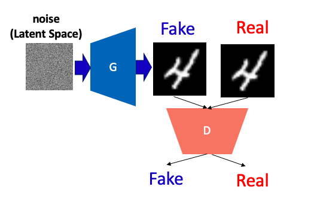
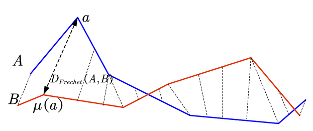

# From GANS to Style GANS to Sythetic Faces

In this piece of text, I will explain how to go from base GANs (Generative adversarial networks) [1] passing by StyleGANS 1 and 2 [2] [3] and how to reach our recent publication [4], where we leverage from style gan 2 to generate faces controlling some semantic factors.

## Generative models and GAN basics

Generative models using deep learning is a topic heavily researched nowadays by both Machine Learning and Computer Vision communities.
Strategies can be roughly divided in two categories: Conditional and Unconditional Generative models.

In short, **Unconditional Generative Models** synthesize data from noise and the two strategies that dominate the literature are Generative Adversarial Networks and Variational Auto-Encoders (VAEs).

Basically, VAEs consist of an encoder $`q_{\phi}(z|x_i)`$  that encodes from real samples $`x_i \in \mathbb{R}^m`$ to an **latent space** $`z \in \mathbb{R}^n`$ and a decoder network $`p_{\theta}(x_i|z)`$ that tries to reconstruct the original sample from samples of the latent space as "precisely" as possible.
Well, I'll not go into the VAE details in this post; probably in other one, who knows.

GANs, on the other hand, learn $`p(z)`$ implicitly in an adversarial manner.
The convolutional GAN consists of two DCNNs: a generator $`G`$ and a discriminator $`D`$.
Roughly speaking $`G`$ generates data from $`z`$ (noise) to "confuse" $`D`$, which is trained as a binary classifier to discriminate if a sample is synthetic or real.
The adversarial loss of this "game" is defined as:

$`{L}_{gan}(G,D;x_i) = \min_{G}\max_{D}\mathbb{E}_{x_i\sim p_{x_i}} \Big[ \log D(x_i)\Big] + \mathbb{E}_{z \sim p(z)}\Big[\log(1-D(G(z)))  \Big]`$

The image below presents an schematic of GANs (took it from https://medium.com/analytics-vidhya/from-gan-basic-to-stylegan2-680add7abe82)

## The Nash equilibrium

Discuss about it...

## Evaluating GANs

As mentioned before GAN is unsupervised, hence it's not possible to use standard supervised learning methods (FAR, FRR, Accuracy, etc..) to evaluate the quality of generated images.
For that, we need to rely on some indicators.
I'll present two of them.

### Frechet Inception Distance (FID score)

The Frechet Inception Distance comes from the Frechet distance, which is a distance metric usually used to measure the distance between two point sets  (shapes, curves, etc).
Given two point sets **S** and **R**, the discrete Frechet Distance between **S** and **R** is defined as:

$`F(S,R) = \min_{\alpha, \beta} D(c_\alpha(S), c_\beta(R))`$

where $`\alpha`$, $`\beta`$ denote an order of the points in both **S** and **R**, $`c_\alpha(S)`$ and $`c_\beta(R)`$ are curvers respecting this order.
**D** is an arbitrary distance metric.
An intuition of such distance can be seen below.

For two multivariate gaussian distributions **A** and **B** the Frechet Distance is defined as:

$` FID(A,B) = || \mu_A, \mu_B||^{2}_{2} + \text{trace}((\Sigma_A + \Sigma_B  -2(\Sigma_A\Sigma_B)^{0.5}`$

**How this connects to GANS?**

The Frechet Inception Distance leverages from the representation capabilities of DCNNs to compute the distance between the latents of synthetically generated images and real images.
Given **A** and **B** as mini-batches of real and synthetic images (PROJECTED IN THE INCEPTION V3 DCNN TRAINED WITH IMAGE NET), the Frechet Inception Distance is defined as:

$` FID(A,B) = || \mu_A, \mu_B||^{2}_{2} + \text{trace}((\Sigma_A + \Sigma_B  -2(\Sigma_A\Sigma_B)^{0.5}`$

Honestly, I don't understand the motivation of this scoring.
I understand that you are trying to measure the distance, in $`z`$, between real and synthetic samples, but I don't understand the purpose of this one in particular.
Why not KL divergency? Or entropy difference between the 2 distributions?

In any case, I think the evaluation of those Generative models is an open area so far.
And I think FID is the one that got traction somehow.

### Perceptual Path Length

## Style GAN

## Style GAN 2

## On the use of.....

## References 
- [1] Goodfellow, Ian; Pouget-Abadie, Jean; Mirza, Mehdi; Xu, Bing; Warde-Farley, David; Ozair, Sherjil; Courville, Aaron; Bengio, Yoshua (2014). Generative Adversarial Networks (PDF). Proceedings of the International Conference on Neural Information Processing Systems (NIPS 2014). pp. 2672–2680.

- [2] Karras, Tero, Samuli Laine, and Timo Aila. "A style-based generator architecture for generative adversarial networks." Proceedings of the IEEE/CVF Conference on Computer Vision and Pattern Recognition. 2019.

- [3] Karras, Tero, et al. "Analyzing and improving the image quality of stylegan." Proceedings of the IEEE/CVF Conference on Computer Vision and Pattern Recognition. 2020.

- [4] Colbois, Laurent, Tiago de Freitas Pereira, and Sébastien Marcel. "On the use of automatically generated synthetic image datasets for benchmarking face recognition." arXiv preprint arXiv:2106.04215 (2021).